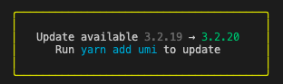
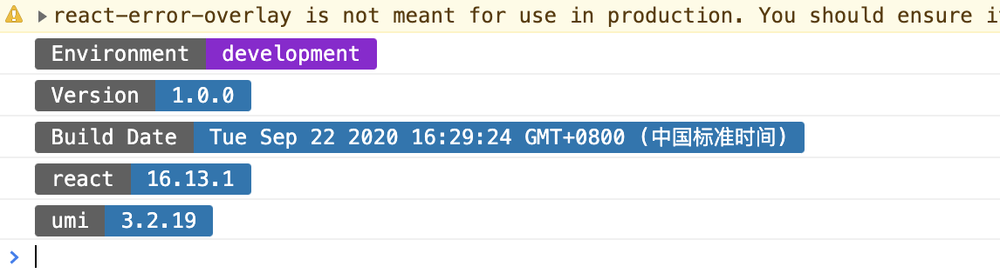

# umi-plugin-hint

[](https://npmjs.org/package/umi-plugin-hint) [](https://npmjs.org/package/umi-plugin-hint)

umi 插件，提示有更新的依赖

## 启用方式

配置开启

## Install

```bash
$ yarn add umi-plugin-hint
```

## Usage

Configure in `.umirc.js` or `config/config.ts`,

```js
export default {
  hint: ['react', 'umi'],
};
```

## Show

developer terminal print



browser print attention dependencies package build version and project build info



## LICENSE

MIT
